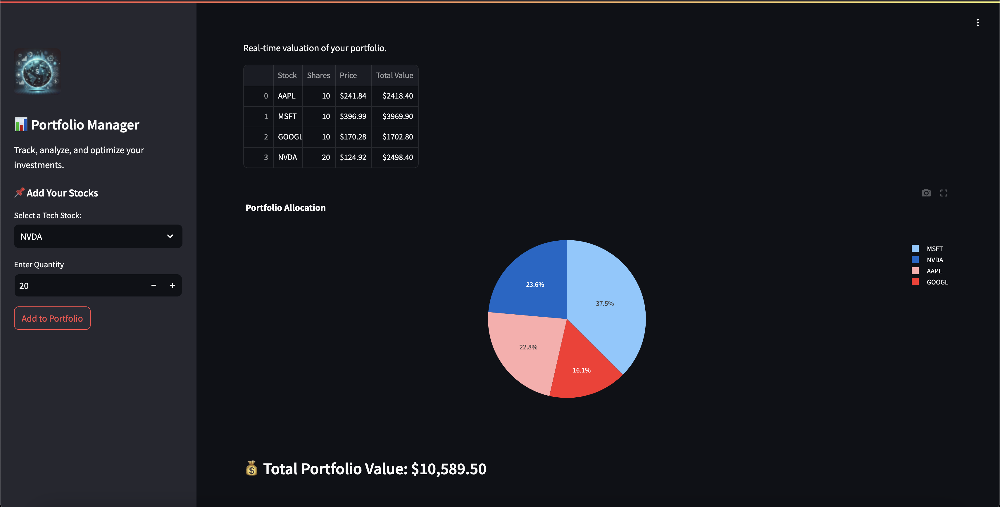
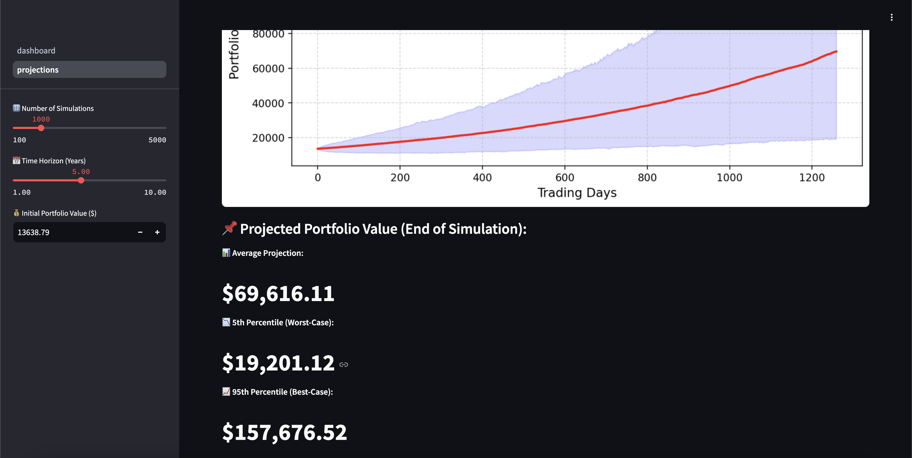

# 📈 Quant Portfolio Dashboard

A professional-grade web dashboard to analyze stock portfolios, optimize asset allocation, and visualize portfolio performance.
## 🎨 Front-End Preview



## 🚀 Features
- **Live Stock Prices** using Yahoo Finance API
- **Portfolio Risk & Performance Metrics** (Sharpe Ratio, Volatility, VaR)
- **Portfolio Optimization** with Efficient Frontier
- **Monte Carlo Simulations** for future projections
- **Interactive Graphs & Visualizations**

## 📦 Setup & Run Locally
### 1️⃣ Clone the Repository
```bash
git clone https://github.com/AruneshDev/quant-portfolio-dashboard.git
cd quant-portfolio-dashboard
```
### 2️⃣ Build & Run with Docker
```bash
docker compose up --build
```
📊 Portfolio Projections Page

The Projections Page uses Monte Carlo Simulations to forecast portfolio growth based on:
✅ Number of simulations
✅ Investment horizon (years)
✅ Expected returns & volatility
🔹 How to Access the Projections Page?

Once the dashboard is running: 1️⃣ Open http://localhost:8501
2️⃣ Click 📈 "Go to Projections"
3️⃣ View future portfolio performance using interactive charts
